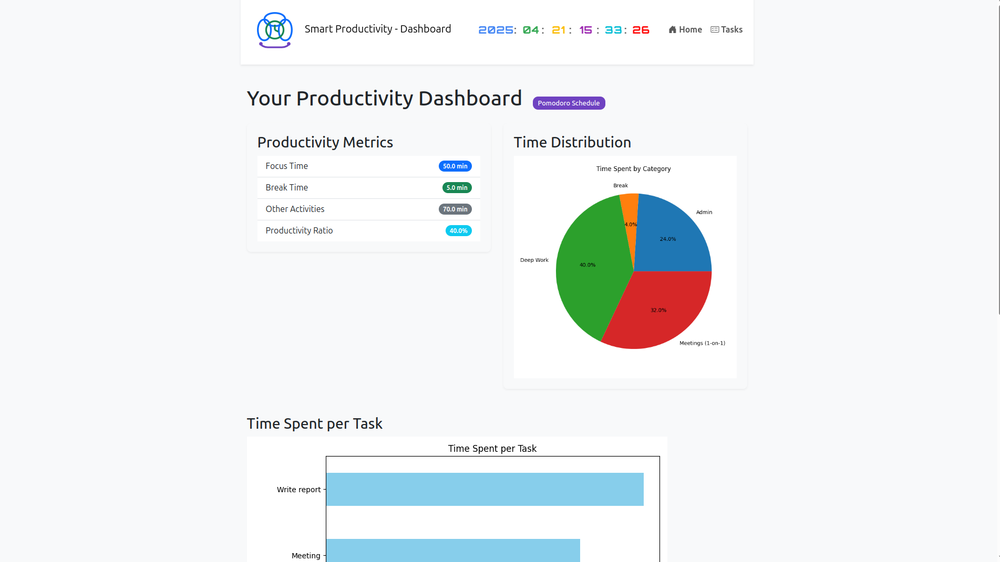

# 🧠 Smart Productivity Dashboard

A dynamic, intelligent task and time management tool designed to optimise productivity using real-time analytics, visual progress feedback, and cognitive-friendly scheduling.

---

## 🚀 Overview

The **Smart Productivity Dashboard** is a Flask-based web application that helps users manage their tasks, visualise progress, and improve focus through features like Pomodoro recommendations and cognitive load balancing. Built for individuals and teams who want to make the most out of their time, this tool intelligently analyses user inputs and adapts daily workflows dynamically.

---

## ✨ Features

- ✅ **Task Manager** – Add, categorise, prioritise, and estimate duration for each task.
- 📊 **Visual Analytics** – View real-time charts and graphs showing your time distribution and performance metrics.
- ⏱ **Pomodoro Timer Recommendations** – Receive structured Pomodoro cycles based on workload and category.
- 🧩 **Cognitive Load Scheduling** – Automatically groups similar tasks to reduce mental strain.
- 📅 **Adaptive Calendar** – Dynamically updates your schedule based on task priority, estimated time, and progress.
- 🎯 **Goal-Oriented Insights** – Track completion rates and maintain focus on your top priorities.

---

## 🔍 How It Works

1. **Input Your Tasks**  
   Add tasks with optional categories (e.g., Work, Study, Personal) and assign estimated durations and priorities.

2. **Intelligent Analysis**  
   The system logs and analyses your task input to calculate performance metrics like category focus, time allocation, and completion rates.

3. **Visual Feedback**  
   Insights are displayed using clean, interactive charts for at-a-glance comprehension of your productivity.

4. **Smart Recommendations**  
   You receive Pomodoro suggestions tailored to your focus pattern and cognitive grouping of tasks to minimise fatigue.

5. **Dynamic Planning**  
   Your task calendar updates in real-time based on your actual progress, adjusting the workflow to reflect shifting priorities.

---

## 🛠️ Tech Stack

- **Backend**: Python (Flask)
- **Frontend**: HTML5, Bootstrap, AOS (Animate On Scroll), Chart.js
- **Database**: SQLite / PostgreSQL (configurable)
- **Visualisation**: Chart.js, Progress Bars, Dynamic Timelines
- **Deployment**: Flask CLI / Gunicorn / Docker-ready

---

## 📁 Project Structure

📦 productivity-dashboard/ ├── 📁 static/ │ └── css, js, icons, assets ├── 📁 templates/ │ └── index.html, dashboard.html, etc. ├── 📁 app/ │ ├── init.py │ ├── routes.py │ ├── models.py │ └── utils.py ├── config.py ├── run.py └── README.md


---

## 📸 Screenshots

| Dashboard | Analytics |
|----------|-----------|
|  |  |

---

## 🧪 Setup Instructions

1. **Clone the Repository**

```bash
git clone https://github.com/yourusername/productivity-dashboard.git
cd productivity-dashboard
